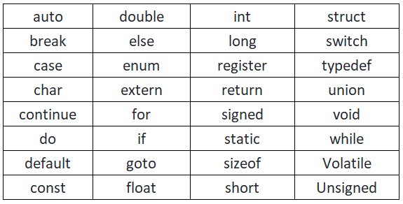

# C Tokens:
* keyword-32 reserved words
* Identifiers
* Constant
* Strings
* Special Symbols
* Operators--unary,binary 
`[Arithmetic operators,Relational Operators,Logical Operators,Assignment Operators,Bitwise Operator,ternary Operator]`

## Keywords

## C Tokens

