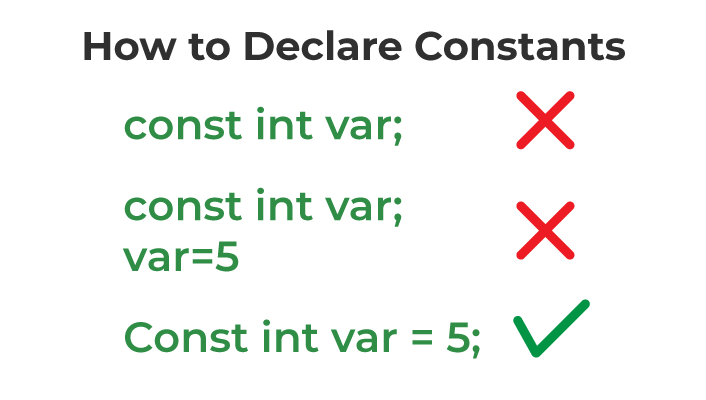

# Constants in C
* The constants in C are the read-only variables whose values cannot be modified once they are declared in the C program. 
*  We can not make any change in the value of the constant variables after they are defined.

# How to Define Constant in C?

`const data_type var_name = value;`


## How to declare a constant



## Types of Constants in C
* Integer Constant
* Character Constant
* Floating Point Constant
* Double Precision Floating Point Constant
* Array Constant
* Structure Constant

# Different ways to declare variable as constant in C
There are many different ways to make the variable as constant in C. Some of the popular ones are:

* Using const Keyword
* Using Macros
* Using enum Keyword

An `enum,` short for "enumeration," is a data type in programming languages that consists of a set of named values. Enums are used to define a collection of constants that are assigned numeric values, typically starting from 0 or 1 and incrementing by 1 for each subsequent value. They provide a way to create symbolic names (constants) for a set of related values, which makes the code more readable and maintainable. Enums are often used to represent things like days of the week, months, status codes, or any other discrete set of values that have a clear order or meaning.

In C, constants are fixed values that do not change during the execution of a program. Constants can be numeric or character constants. Here’s a detailed explanation of each type along with examples:

### 1. Numeric Constants
Numeric constants are constant values that represent numbers. They can be further classified into:

#### a. Integer Constants
Integer constants represent whole numbers without any fractional part.

**Types of Integer Constants:**
- **Decimal**: Base 10 (e.g., `123`)
- **Octal**: Base 8, prefixed with `0` (e.g., `0123`)
- **Hexadecimal**: Base 16, prefixed with `0x` or `0X` (e.g., `0x7B`)

**Example:**
```c
#include <stdio.h>

int main() {
    int decimal = 123;
    int octal = 0123;        // Octal 123 is decimal 83
    int hexadecimal = 0x7B;  // Hexadecimal 7B is decimal 123

    printf("Decimal: %d\n", decimal);
    printf("Octal: %d\n", octal);
    printf("Hexadecimal: %d\n", hexadecimal);

    return 0;
}
```

#### b. Floating-Point Constants
Floating-point constants represent numbers with a fractional part.

**Types of Floating-Point Constants:**
- **Decimal notation**: e.g., `123.45`
- **Exponential notation**: e.g., `1.2345e2` (equivalent to `123.45`)

**Example:**
```c
#include <stdio.h>

int main() {
    float decimal = 123.45;
    float exponential = 1.2345e2;

    printf("Decimal notation: %f\n", decimal);
    printf("Exponential notation: %f\n", exponential);

    return 0;
}
```

### 2. Character Constants
Character constants represent individual characters enclosed in single quotes (`'`). They can also include escape sequences.

**Types of Character Constants:**
- **Single character**: e.g., `'a'`, `'1'`, `'$'`
- **Escape sequences**: Special characters represented by a backslash (`\`) followed by one or more characters.

**Common Escape Sequences:**
- `\n` : Newline
- `\t` : Horizontal tab
- `\\` : Backslash
- `\'` : Single quote
- `\"` : Double quote

**Example:**
```c
#include <stdio.h>

int main() {
    char char1 = 'a';
    char char2 = '\n';  // Newline character
    char char3 = '\t';  // Tab character
    char char4 = '\\';  // Backslash character
    char char5 = '\'';  // Single quote character
    char char6 = '\"';  // Double quote character

    printf("Char1: %c\n", char1);
    printf("Char2 (newline): %cAfter newline\n", char2);
    printf("Char3 (tab): %cAfter tab\n", char3);
    printf("Char4: %c\n", char4);
    printf("Char5: %c\n", char5);
    printf("Char6: %c\n", char6);

    return 0;
}
```

### Summary Table

| Type                 | Example(s)                      | Explanation                                    |
|----------------------|----------------------------------|------------------------------------------------|
| Decimal Integer      | `123`                            | Standard base 10 integer                       |
| Octal Integer        | `0123`                           | Base 8 integer (starts with `0`)               |
| Hexadecimal Integer  | `0x7B`, `0X7B`                   | Base 16 integer (starts with `0x` or `0X`)     |
| Decimal Float        | `123.45`                         | Floating-point number in decimal notation      |
| Exponential Float    | `1.2345e2`                       | Floating-point number in exponential notation  |
| Single Character     | `'a'`, `'1'`, `'$'`              | Single character enclosed in single quotes     |
| Escape Sequence      | `'\n'`, `'\t'`, `'\\'`, `'\''`   | Special characters represented with backslash  |

These are the fundamental types of numeric and character constants in C, each with specific usage and syntax.


In C, you can use the `#define` directive to declare constants using macros. Macros allow you to define constants with meaningful names that can be easily substituted throughout your code.

### Declaring Constants Using Macros

1. **Character Constants**:
   - A character constant is enclosed in single quotes (`'`).

2. **Integer Constants**:
   - An integer constant can be a decimal, octal, or hexadecimal value.

3. **Floating-Point Constants**:
   - A floating-point constant can be a decimal number or a number in exponential notation.

### Examples

#### Character Constants
```c
#include <stdio.h>

#define CHAR_A 'A'
#define CHAR_NEWLINE '\n'
#define CHAR_TAB '\t'

int main() {
    printf("Character A: %c\n", CHAR_A);
    printf("Newline Character: %c", CHAR_NEWLINE);
    printf("Tab Character: %cAfter tab\n", CHAR_TAB);

    return 0;
}
```

#### Integer Constants
```c
#include <stdio.h>

#define DECIMAL_NUMBER 123
#define OCTAL_NUMBER 0123      // Octal 123 is decimal 83
#define HEXADECIMAL_NUMBER 0x7B // Hexadecimal 7B is decimal 123

int main() {
    printf("Decimal Number: %d\n", DECIMAL_NUMBER);
    printf("Octal Number: %d\n", OCTAL_NUMBER);
    printf("Hexadecimal Number: %d\n", HEXADECIMAL_NUMBER);

    return 0;
}
```

#### Floating-Point Constants
```c
#include <stdio.h>

#define DECIMAL_FLOAT 123.45
#define EXPONENTIAL_FLOAT 1.2345e2

int main() {
    printf("Decimal Float: %f\n", DECIMAL_FLOAT);
    printf("Exponential Float: %f\n", EXPONENTIAL_FLOAT);

    return 0;
}
```

### Summary
Here is a summary table of how to declare character, integer, and floating-point constants using macros:

| Type                 | Macro Declaration                         | Example Value        |
|----------------------|-------------------------------------------|----------------------|
| Character            | `#define CHAR_A 'A'`                      | `CHAR_A`             |
| Character (newline)  | `#define CHAR_NEWLINE '\n'`               | `CHAR_NEWLINE`       |
| Character (tab)      | `#define CHAR_TAB '\t'`                   | `CHAR_TAB`           |
| Decimal Integer      | `#define DECIMAL_NUMBER 123`              | `DECIMAL_NUMBER`     |
| Octal Integer        | `#define OCTAL_NUMBER 0123`               | `OCTAL_NUMBER`       |
| Hexadecimal Integer  | `#define HEXADECIMAL_NUMBER 0x7B`         | `HEXADECIMAL_NUMBER` |
| Decimal Float        | `#define DECIMAL_FLOAT 123.45`            | `DECIMAL_FLOAT`      |
| Exponential Float    | `#define EXPONENTIAL_FLOAT 1.2345e2`      | `EXPONENTIAL_FLOAT`  |

By using macros to declare constants, you can easily manage and maintain your constants in a centralized manner, making your code more readable and easier to update.
